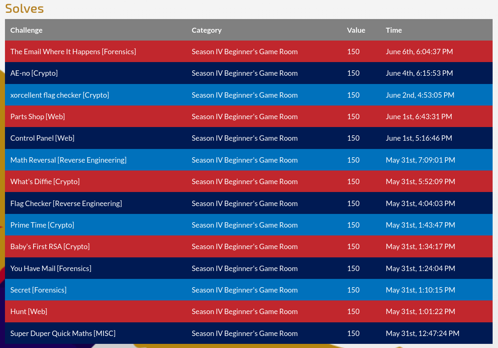

# Season IV, US Cyber Open: Beginner's Game Room Writeup

I participated in the Beginner's Game Room as part of Season IV of the [US Cyber Open](https://www.uscybergames.com/). This was a week-long CTF competition that ran from 5/31/2024 through 6/9/2024.
This was my second ever CTF, and while I was only able to solve about half of the challenges, I had a blast and boosted my skills tremendously.

Below, you'll find writeups for all of the challenges I completed. I am also including writeups for incomplete challenges that I attempted. Information on my results in the competition and the software I used can be found below my writeup links.

Click [here](https://github.com/rstacks/ctf-writeups) to check out my writeups for other CTFs I've participated in.

## Solved Challenges

  
Crypto

  * [AE-no](https://github.com/rstacks/USCyberOpenSeasonIV-BeginnersGameRoom-writeup/tree/master/Crypto/AE-no)
  * [Baby's First RSA](https://github.com/rstacks/USCyberOpenSeasonIV-BeginnersGameRoom-writeup/tree/master/Crypto/BabysFirstRSA)
  * [Prime Time](https://github.com/rstacks/USCyberOpenSeasonIV-BeginnersGameRoom-writeup/tree/master/Crypto/PrimeTime)
  * [What's Diffie](https://github.com/rstacks/USCyberOpenSeasonIV-BeginnersGameRoom-writeup/tree/master/Crypto/WhatsDiffie)
  * [xorcellent flag checker](https://github.com/rstacks/USCyberOpenSeasonIV-BeginnersGameRoom-writeup/tree/master/Crypto/xorcellentFlagChecker)

  
Forensics

  * [Secret](https://github.com/rstacks/USCyberOpenSeasonIV-BeginnersGameRoom-writeup/tree/master/Forensics/Secret)
  * [The Email Where It Happens](https://github.com/rstacks/USCyberOpenSeasonIV-BeginnersGameRoom-writeup/tree/master/Forensics/TheEmailWhereItHappens)
  * [You Have Mail](https://github.com/rstacks/USCyberOpenSeasonIV-BeginnersGameRoom-writeup/tree/master/Forensics/YouHaveMail)
  

  
Misc

  * [Super Duper Quick Maths](https://github.com/rstacks/USCyberOpenSeasonIV-BeginnersGameRoom-writeup/tree/master/Misc/SuperDuperQuickMaths)
  

  
Reverse Engineering

  * [Flag Checker](https://github.com/rstacks/USCyberOpenSeasonIV-BeginnersGameRoom-writeup/tree/master/ReverseEngineering/FlagChecker)
  * [Math Reversal](https://github.com/rstacks/USCyberOpenSeasonIV-BeginnersGameRoom-writeup/tree/master/ReverseEngineering/MathReversal)
  

  
Web

  * [Control Panel](https://github.com/rstacks/USCyberOpenSeasonIV-BeginnersGameRoom-writeup/tree/master/Web/ControlPanel)
  * [Hunt](https://github.com/rstacks/USCyberOpenSeasonIV-BeginnersGameRoom-writeup/tree/master/Web/Hunt)
  * [Parts Shop](https://github.com/rstacks/USCyberOpenSeasonIV-BeginnersGameRoom-writeup/tree/master/Web/PartsShop)
  

## Unfinished Challenges

  
Pwn

  * [Fanum Tax](https://github.com/rstacks/USCyberOpenSeasonIV-BeginnersGameRoom-writeup/tree/master/Pwn/FanumTax_UNFINISHED)
  

## Results

I successfully completed 14 challenges, scoring a total of **2100 points**. While it says I finished in 186th place, this is not really meaningful, as the rankings include players' scores from both the Beginner's Game Room and the Season IV Competitive CTF that occurred at the same time. There were 1,353 participants (that solved at least one challenge) between these two events.

## Software and Tools

I used my laptop with [Ubuntu 22.04](https://ubuntu.com/desktop) for this competition. I also used [Kali Linux](https://www.kali.org/) through [VirtualBox](https://www.virtualbox.org/) for tools like Burp Suite and Wireshark. Here is a short
list of some of the tools I used for this competition:
- [CyberChef](https://cyberchef.org/): Great for cryptography challenges.
- [dogbolt.org](https://dogbolt.org/): The Decompiler Explorer. I used it to analyze executables for reverse engineering challenges.
- [Burp Suite](https://portswigger.net/burp/communitydownload): Enables interception of web requests and provides other web exploitation tools.
- [Wireshark](https://www.wireshark.org/): Great for analyzing network communications.
